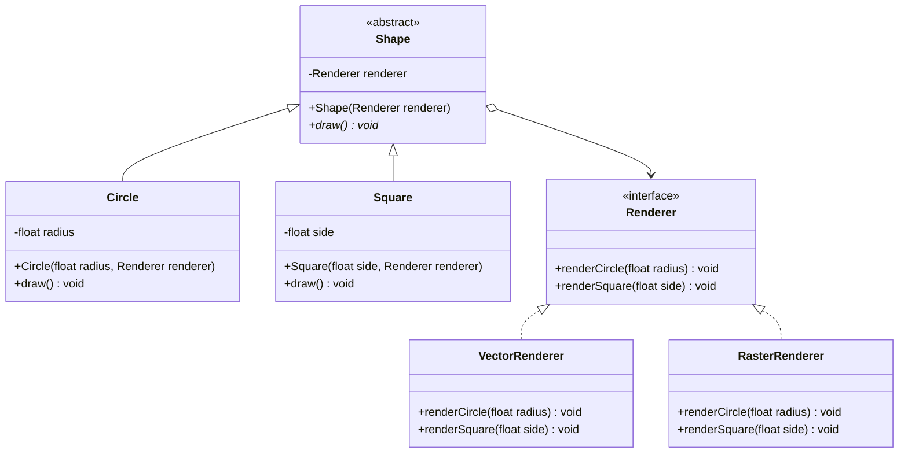

## UML Diagram

```mermaid
classDiagram
    class Shape {
        <<abstract>>
        -Renderer renderer
        +Shape(Renderer renderer)
        +draw()* void
    }
    
    class Circle {
        -float radius
        +Circle(float radius, Renderer renderer)
        +draw() void
    }
    
    class Square {
        -float side
        +Square(float side, Renderer renderer)
        +draw() void
    }
    
    class Renderer {
        <<interface>>
        +renderCircle(float radius) void
        +renderSquare(float side) void
    }
    
    class VectorRenderer {
        +renderCircle(float radius) void
        +renderSquare(float side) void
    }
    
    class RasterRenderer {
        +renderCircle(float radius) void
        +renderSquare(float side) void
    }
    
    Shape <|-- Circle
    Shape <|-- Square
    Renderer <|.. VectorRenderer
    Renderer <|.. RasterRenderer
    Shape o--> Renderer
```
